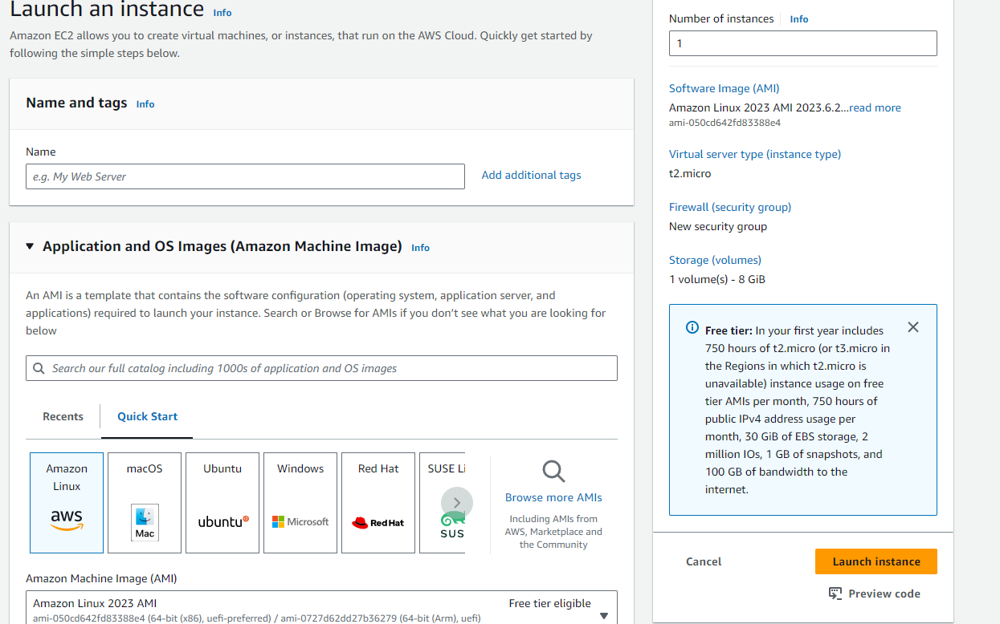
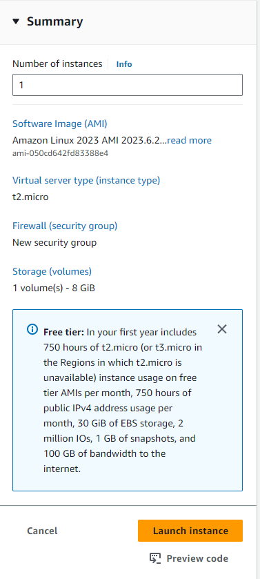

## AWS Setup Guide - CS 3733 B24 
Vivek Jagadeesh
### Overview
This guide will help you setup an AWS account and deploy a flask app with a PostgreSQL backend to AWS EC2 and RDS. 

## Warning
AWS requires a credit card for all accounts. Deviating from the guidelines in these instructions could result in charges

### Step 1 - Make an AWS account
1. Head to [aws.amazon.com](https://aws.amazon.com) and click on "create an AWS account" in the top right hand corner. 
2. Use your wpi.edu email address to create a new account. Give the account a name so that you remember it is for software engineering (and thus will only have one free tier offer). 
3. When prompted, choose a buisiness account and enter WPI's contact information. 
4. Next, enter billing information. This guide will show you how to use AWS within the free tier, but AWS requires that there be some billing information on file. 

### Step 2 - Spawn an EC2 instance 
- EC2 (Elastic Cloud Compute) is an AWS service which creates a remote virtual machine which will run our application. We need to create a new instance (VM) before deploying our code. 
1. In the search bar, search for "EC2", and click on the first option that appears under services. 
2. Once on the EC2 home page, click on the orange button in the middle of the center column which says "Launch Instance". This should bring you to the following page :

3. Name your EC2 instance something that you will remember. 
4. Select "Amazon Linux" as the AMI, and continue to the next step. 
5. Make sure the instance type is set to t2.micro (this is VERY important. Any other instance type will result in immediate charges. )
6. Create a new key-pair. This is how you are going to SSH into your EC2 instance. When prompted, select the RSA type and .pem format, and then click on "create key pair". Save this key somewhere safe, as it will be required every time you need to deploy your code. 
7. In the network settings tab, select the following
    - Allow SSH traffic from anywhere
    - Allow HTTPS traffic from anywhere
    - Allow HTTP traffic from anywhere
8. Do not change the other settings. 
9. Make sure your summary on the right hand side matches the below image: 

10. You can now launch the instance. 

### Step 3 - Setting up RDS 
- RDS (relational database services) allows us to run postgres (or another DBMS) on its own server. This is much faster than if we ran everything on EC2. 
1. Search for RDS in the search bar and select the first result. 
2. On the RDS home page, click on create database. 
3. Select "standard-create" at the top of the page, and then select PostgreSQL as the database engine. 
4. IMPORTANT: Select the free tier for the instance size. Any other choice will result in charges. 
5. Continue by adding a name for your database, then add a master user and password. I suggest making both of these postgres. 
6. Change the instance configuration to db.t3.micro. 
7. IMPORTANT: in the storage panel, click on storage autoscaling and disable it. 
8. Set your database to connect to an EC2 resource, and then select the EC2 instance you created earlier. 
9. Finally, in the additional configuration options, add an initial database name of postgres, and change the backup retention period to 0 days. 
10. You can now safley create the database. 

### Step 4 - Connecting to EC2
- Now that your EC2 instance has been created, we need to connect to it. 
- Note -> windows users should use powershell for this step, others can proceed with the terminal. 
1. Start on the EC2 dashboard, and click the instances(running) tile in the left hand corner. 
2. click on the ec2 instance that you just created. 
3. Locate the public ipv4 address for your instance and copy it. 
4. Windows users: Run the following command in powershell to install openssh: 
"Add-WindowsCapability -Online -Name OpenSSH.Client~~~~0.0.1.0" (MacOS and Linux users do not need to do this)
5. MacOs/Linux users: run "chmod go = [INSERT PATH TO .PEM FILE HERE]" (make sure to inclue a space around the equals sign)
6. Now, run the following command <code>ssh ec2-user@[IPV4 ADDRESS HERE] -i [FILE PATH TO .pem FILE HERE]</code>.  (surround path with quotes)
7. You should now be able to ssh into your ec2 instance. You may get a question asking if you want to connect, just type yes. When you have connected, you will see an eagle and info on the AMI. 
### Step 5 - Enabling git and Docker on EC2
- Once SSHed into EC2, we need to add docker and git. Run the following commands
#### Step 5A: Docker and docker-compose 
Note -> for an explanation of docker, see the bottom of the file
1. <code> sudo yum install docker </code> (This installs docker)
2. <code> sudo chkconfig docker on </code> (This starts docker auto-start)
3. <code> sudo systemctl start docker </code> 
4. <code> sudo systemctl enable docker </code>
5. <code> sudo usermod -a -G docker ec2-user </code>
6. Now we need to log into docker. Run <code>docker login</code> and enter your docker hub username and password

### Step 5B - install Docker compose

1. <code>“sudo curl -L
https://github.com/docker/compose/releases/latest/download/docker-compose-$(uname
-s)-$(uname -m) -o /usr/local/bin/docker-compose”</code>
2. Run <code>sudo chmod +x /usr/local/bin/docker-compose</code>
3. To verify the installation run <code> docker-compose version </code>. You should see a version number (if nothing prints, the instalation failed). 

Now log out of EC2 by typing <code>exit</code>

## Step 6 - Docker and Docker Hub
Docker is a tool which allows us to run our code inside of a container. You can think of containers as virtual machines which are meant to only run our code. Containers are useful because: 
- They standardize the environment (every container built will run the code in the exact same way). 
- They allow us to build the project on our local machines (this is important because EC2 is not powerful enough to build our application). 
1. Navigate to [https://hub.docker.com/](https://hub.docker.com/), and click the sign up button in the top right hand corner. Create an account. 
2. Once you have an account, log in and go to the repositories tab of the dashboard. Create a new repository (name it something to do with the current assignment). 
3. After you have made a repository, you need to install Docker desktop on your personal machine at [https://www.docker.com/products/docker-desktop/](https://www.docker.com/products/docker-desktop/) (make sure you install the right version for your machine). 
4. Now, open docker desktop and log into your account. Leave docker open in the background
5. Now, in the terminal, run  <code>docker version</code> to verify the installation. 
6. Finally, in the terminal, run <code>docker login</code> and login using your username and password. 

## Step 7 - Initial Deployment
### Step 7A - building the container locally
- First, we need to edit the <code>build.sh</code> and <code>deploy.sh</code> scripts included in this guide. 
- In <code>build.sh</code>, replace vivekjag1 with your docker hub username. Failing to do so will result in your container not being pushed. 
- You may also want to replace the repository name (currently listed as softengproduction) if you want to save your containers between iterations/assignments. 
- In <code>deploy.sh</code>, replace vivekjag1 with your docker hub username again. 
- Now, run <code>build.sh</code> on your local machine. This may take a few minutes. This is going to use the dockerfile in your repository (see file for detailed walkthrough) to build the container and start your project. 
### Step B - deploying the container to EC2
- This is the final step. SSH into your EC2 instance. 
- Next, we need to pull the container you just pushed to docker hub. Run <code>docker pull yourUsername/YOUR-REPOSITORY-NAME</code>. This will take a second. 
- Now that the container is pulled, all that we have to do is run it. Simply type <code>docker run -d -p 80:80 YOUR-DOCKER-HUB-USERNAME/YOUR-REPO-NAME </code>, and your container will start. 
    - If you need to debug something, omit the -d flag. This starts the container in "decoupled mode" which means that no ouput is displayed. 
- Between iterations, make sure to run <code> docker system prune </code>. This will clean up containers not being used, and will prevent you from running out of storage.
- Your app should be accessible on the HTTP url. Use the public ipv4 link (which we used to ssh into the server), and MAKE SURE TO START THE LINK WITH HTTP. Your website will not be available via HTTPS since we did not configure an SSL certificate. So, your website should be available on http://[INSERT IP]
### Avoiding charges
- AWS provides 750 hours a month of EC2 for free. This is more than the number of hours in a month, so it is safe to leave your instances up 24/7. This offer expires after 1 year, so make sure to take down all instances as soon as the course is over. 
- As a general rule of thumb, never have more than one ec2 instance running at once. Deploy all your applications to the same server, and terminate that EC2 instance after the course is over. 

